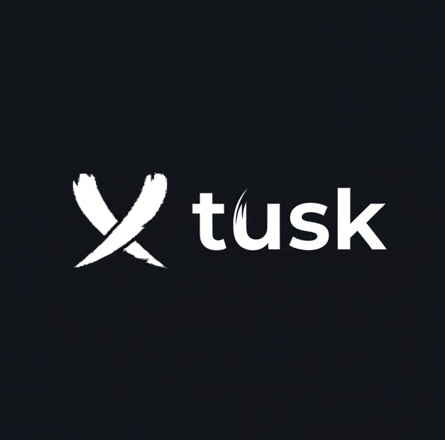

# Tusk

**블록체인 기반 안전한 채용 매칭 플랫폼**

Tusk는 Sui 네트워크의 컨트랙트와 Walrus 분산 저장소를 활용하여  
구직자의 승인 없이는 누구도 이력서에 접근할 수 없는 차세대 채용 환경을 구축합니다.

## 🎯 문제 정의

현재 채용 시장에서는 구직자의 개인정보 보호에 심각한 문제가 존재합니다. 대부분의 채용 플랫폼에서 채용 담당자는 구직자의 명시적인 동의 없이도 이력서와 개인정보를 자유롭게 열람할 수 있습니다. 이는 구직자의 프라이버시를 침해할 뿐만 아니라, 개인정보가 무분별하게 노출되는 결과를 초래합니다.

또한 중앙화된 서버에 모든 데이터가 저장되는 구조는 해킹이나 내부 유출 등의 보안 위협에 취약합니다. 한 번의 보안 사고로 수많은 구직자의 민감한 정보가 유출될 수 있는 위험이 항상 존재합니다.

가장 큰 문제는 구직자가 자신의 정보에 대한 통제권을 전혀 가지지 못한다는 점입니다. 기존 플랫폼에서는 프로필을 등록하는 순간 모든 채용 담당자에게 정보가 공개되지만, 많은 구직자들은 진지하게 채용 프로세스에 진입한 경우에만 상세한 이력서를 공개하고 싶어합니다.

하지만 현재 시스템에서는 누가, 언제, 어떤 목적으로 자신의 이력서를 열람했는지 알 수 없으며, 선택적으로 정보를 공개할 방법도 없습니다. 이러한 불투명한 시스템은 구직자에게 심리적 부담을 주고, 구직자와 채용 담당자 간의 신뢰를 저해하며, 건강한 채용 생태계 형성을 방해합니다.

---

## 💡 솔루션

**Tusk**는 블록체인 기반 접근 제어 시스템을 통해 이러한 문제를 근본적으로 해결합니다.

채용 담당자는 더 이상 구직자의 정보를 임의로 열람할 수 없으며, 반드시 허가를 요청하고 승인을 받아야만 이력서에 접근할 수 있습니다. 이를 통해 구직자는 단순히 프로필을 탐색하는 단계와 실제 채용 프로세스에 진입하는 단계를 명확히 구분할 수 있으며, 진지한 채용 의사가 있는 기업에게만 선택적으로 상세 정보를 공개할 수 있습니다.

모든 이력서는 업로드 시점에 암호화되어 Walrus 분산 네트워크에 저장되므로, 중앙 서버 해킹이나 단일 장애점으로 인한 데이터 유출 위험이 원천적으로 차단됩니다.

접근 권한 관리는 Sui 블록체인의 스마트 컨트랙트가 자동으로 처리하며, 모든 접근 요청과 승인 내역은 블록체인에 불변의 기록으로 남습니다. 이를 통해 누가 언제 어떤 정보에 접근했는지 완전히 투명하게 추적할 수 있습니다.

**가장 중요한 것은 구직자가 자신의 정보에 대한 완전한 통제권을 갖게 된다는 점**입니다. 원하는 채용 담당자에게만 선택적으로 정보를 공개할 수 있으며, 무분별한 정보 노출에 대한 부담 없이 안심하고 구직 활동을 할 수 있습니다.

## ✨ 주요 기능

### 🔐 프라이버시 우선 설계

- **종단간 암호화**: 모든 이력서와 민감 데이터는 업로드 전 암호화되어 저장
- **허가 기반 접근 제어**: 구직자의 명시적 승인 없이는 누구도 데이터에 접근 불가
- **탈중앙화 저장소**: Walrus 분산 네트워크를 통한 안전한 파일 저장 및 중복성 보장

### 🤝 AI 기반 스마트 매칭

- **의미론적 검색**: 벡터 임베딩을 활용하여 직무와 후보자를 정확하게 매칭
- **다차원 필터링**: 기술 스택, 경력, 희망 조건 등 다양한 기준으로 검색
- **프라이버시 보존**: 개인 식별 정보 노출 없이 매칭 결과 제공

### ⚡ 블록체인 기반 투명성

- **불변의 접근 기록**: 모든 열람 요청과 승인 내역이 블록체인에 영구 기록
- **자동화된 권한 관리**: Sui 스마트 컨트랙트가 접근 권한을 자동으로 처리
- **투명한 접근 이력**: 누가 언제 정보를 열람했는지 블록체인에서 확인 가능

---

## 시스템 아키텍처

### 전체 플로우

#### 1. 구직자 등록 및 이력서 업로드

**프로세스:**

1. Sui 네트워크 컨트랙트를 통해 접근 정책 생성
2. 업로드한 이력서를 Seal SDK를 사용하여 암호화
3. 암호화 키가 Seal Key Servers에 분산 저장
4. 암호화된 이력서를 Walrus 네트워크 업로드
5. 이력서 파일을 LLM을 통해 직무 기술스택 등을 라벨링
6. 라벨링된 데이터를 벡터 임베딩 하여 저장

**핵심 기술:**

- **Sui Access Policy Contract**: 블록체인 기반 접근 권한 정책 객체 생성
- **Walrus Network**: 탈중앙화 파일 저장소를 통한 안전한 데이터 보관
- **Google Gemini AI**: 이력서 내용 분석 및 자동 라벨링
- **Vector Embedding**: 의미론적 검색을 위한 고차원 벡터 변환 및 저장

---

#### 2. 채용 담당자 검색

**프로세스:**

1. 채용 담당자가 조건에 맞는 후보자 검색 요청
2. AI 벡터 유사도 쿼리로 관련 프로필 반환
3. 민감 정보는 제외된 기본 정보만 표시

**핵심 기술:**

- Google Gemini AI를 활용한 벡터 임베딩
- PostgreSQL + pgvector를 통한 유사도 검색
- 서버 사이드 필터링으로 개인정보 보호

---

#### 3. 접근 권한 요청

**프로세스:**

1. 채용 담당자가 특정 구직자의 상세 정보 접근 요청
2. Sui 네트워크에 View Request Object 생성
3. 요청 정보가 데이터베이스에 저장
4. 구직자에게 알림 전송

---

#### 4. 구직자 승인/거절

**프로세스:**

1. 구직자가 접근 요청 검토
2. 승인 또는 거절 결정
3. 정책 컨트랙트의 `Approve`혹은 `Reject` 함수 실행
4. 승인 상태가 블록체인에 기록

---

#### 5. 승인된 채용 담당자의 이력서 열람

**프로세스:**

1. 암호화된 데이터를 Walrus에서 가져옴
2. Session Key와 Seal Access Policy Contract의 권한 확인 트랜잭션 생성 및 서명
3. Seal Server에 복호화 키 요청
4. 복호화 키로 암호화된 데이터 복호화
5. 복호화된 데이터를 다운로드

**핵심 기술:**

- Seal Key Server를 통한 키 관리
- 권한 검증 후 복호화

---
