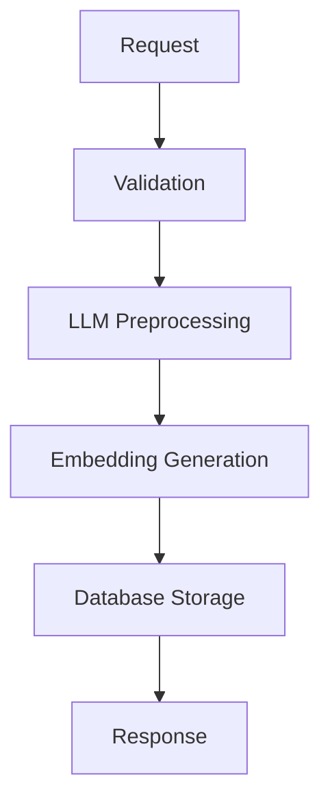

# Applicants API Documentation

## POST /api/v1/applicants

지원자를 등록하는 API입니다. 이력서 정보를 받아 AI 임베딩을 생성하고 데이터베이스에 저장합니다.

### Request

#### Endpoint
```
POST /api/v1/applicants
```

#### Headers
```
Content-Type: application/json
```

#### Request Body

| Field | Type | Required | Description |
|-------|------|----------|-------------|
| `handle` | `string` | ✅ | 지원자의 핸들/닉네임 (예: @username) |
| `walletAddress` | `string` | ✅ | 지갑 주소 (고유값, 중복 불가) |
| `position` | `string` | ✅ | 희망 직무 (예: "풀스택 개발자") |
| `techStack` | `string[]` | ✅ | 기술 스택 배열 (최소 1개 이상) |
| `aiSummary` | `string` | ✅ | AI가 생성한 이력서 요약 |
| `blobId` | `string` | ❌ | Walrus blob ID (선택) |
| `sealPolicyId` | `string` | ❌ | Seal policy ID (선택) |
| `accessPrice` | `number` | ❌ | 이력서 열람 가격 (기본값: 0) |
| `isJobSeeking` | `boolean` | ❌ | 구직 중 여부 (기본값: true) |

#### Example Request

```json
{
  "handle": "@john_doe",
  "walletAddress": "0x1234567890abcdef1234567890abcdef12345678",
  "position": "Backend Developer",
  "techStack": [
    "TypeScript",
    "NestJS",
    "PostgreSQL",
    "Docker",
    "AWS"
  ],
  "aiSummary": "3년 경력의 백엔드 개발자로 NestJS를 활용한 RESTful API 개발 및 마이크로서비스 아키텍처 설계 경험을 보유하고 있습니다.",
  "blobId": "blob_xyz123",
  "sealPolicyId": "seal_policy_abc456",
  "accessPrice": 50000,
  "isJobSeeking": true
}
```

### Response

#### Success Response (201 Created)

```json
{
  "success": true,
  "data": "f99db28d-81fa-4eaf-b054-a6a7dfecf169"
}
```

**Response Fields:**
- `success`: 성공 여부 (boolean)
- `data`: 생성된 지원자의 UUID (string)

#### Error Responses

##### 400 Bad Request - Validation Failed

요청 데이터가 유효하지 않을 때 반환됩니다.

```json
{
  "success": false,
  "errorMessage": "Validation failed"
}
```

**발생 원인:**
- 필수 필드 누락 (`handle`, `walletAddress`, `position`, `techStack`, `aiSummary`)
- 잘못된 타입 (예: `accessPrice`가 문자열)
- 빈 배열 (`techStack`이 빈 배열)

##### 500 Internal Server Error - Processing Failed

서버 내부 처리 중 오류가 발생했을 때 반환됩니다.

```json
{
  "success": false,
  "errorMessage": "Failed to preprocess data for embedding"
}
```

또는

```json
{
  "success": false,
  "errorMessage": "Internal server error"
}
```

**발생 원인:**
- LLM 전처리 실패
- 임베딩 생성 실패
- 데이터베이스 저장 실패
- 중복된 `walletAddress` (unique constraint violation)

### Processing Flow

API는 다음 단계로 처리됩니다:



1. **Validation**: Zod 스키마를 사용한 요청 데이터 검증
2. **LLM Preprocessing**: AI를 활용한 이력서 데이터 전처리 (키워드 추출, 영어 번역)
3. **Embedding Generation**: 768차원 벡터 임베딩 생성 (Gemini embedding-001)
4. **Database Storage**: Supabase PostgreSQL + pgvector에 저장

### Performance

- **평균 응답 시간**: 10-15초
  - LLM Preprocessing: ~2-3초
  - Embedding Generation: ~8-10초
  - Database Storage: ~100ms

### Constraints

- **walletAddress**: 유니크 제약 조건 (한 지갑당 하나의 계정만 가능)
- **techStack**: 최소 1개 이상 필수
- **accessPrice**: 0 이상의 정수
- **embedding**: 자동 생성 (768차원 벡터)

### Example cURL

```bash
curl -X POST http://localhost:3000/api/v1/applicants \
  -H "Content-Type: application/json" \
  -d '{
    "handle": "@john_doe",
    "walletAddress": "0x1234567890abcdef1234567890abcdef12345678",
    "position": "Backend Developer",
    "techStack": ["TypeScript", "NestJS", "PostgreSQL"],
    "aiSummary": "3년 경력의 백엔드 개발자입니다."
  }'
```

### Example JavaScript/TypeScript

```typescript
const response = await fetch('http://localhost:3000/api/v1/applicants', {
  method: 'POST',
  headers: {
    'Content-Type': 'application/json',
  },
  body: JSON.stringify({
    handle: '@john_doe',
    walletAddress: '0x1234567890abcdef1234567890abcdef12345678',
    position: 'Backend Developer',
    techStack: ['TypeScript', 'NestJS', 'PostgreSQL'],
    aiSummary: '3년 경력의 백엔드 개발자입니다.',
  }),
});

const data = await response.json();

if (response.ok) {
  console.log('Applicant ID:', data.data);
} else {
  console.error('Error:', data.errorMessage);
}
```

### Notes

- 이 API는 **idempotent하지 않습니다**. 같은 요청을 여러 번 보내면 `walletAddress` 중복 에러가 발생합니다.
- LLM 호출로 인해 응답 시간이 다소 길 수 있습니다 (~10-15초).
- 벡터 임베딩은 자동으로 생성되며, 이후 벡터 유사도 검색에 사용됩니다.
- 프로덕션 환경에서는 rate limiting 적용을 권장합니다.

### Related Endpoints

- `GET /api/v1/applicants/:id` - 지원자 조회 (예정)
- `GET /api/v1/applicants/search` - 벡터 유사도 검색 (예정)
- `PATCH /api/v1/applicants/:id` - 지원자 정보 수정 (예정)

### Changelog

#### v1.0.0 (2025-01-22)
- 초기 구현
- Repository + Service Layer 패턴 적용
- LLM 기반 임베딩 생성 추가
